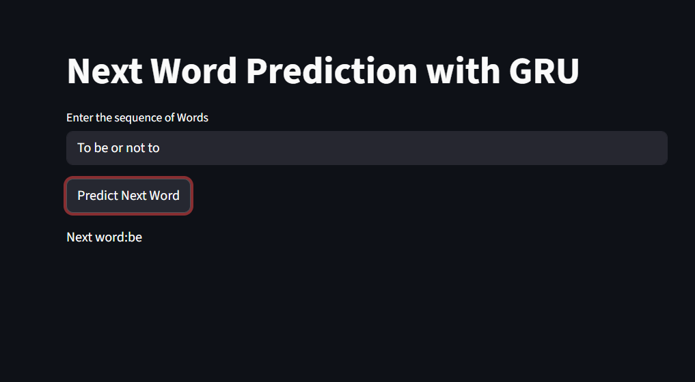

# GRU-RNN
🚀 Next Word Prediction using GRU-RNN
This project implements a Gated Recurrent Unit (GRU) based language model to predict the next word in a sequence. Trained on Shakespeare's Hamlet, it demonstrates the efficiency of GRUs in capturing sequential dependencies with a simplified gate architecture compared to LSTMs.

📌 Project Overview
Following the development of an LSTM-based predictor, this project explores the GRU architecture. GRUs are designed to solve the vanishing gradient problem while using fewer parameters than LSTMs, often leading to faster training times on smaller datasets like the NLTK Gutenberg corpus.

🛠️ Technical Stack
Deep Learning Framework: TensorFlow / Keras

Architecture: Sequential GRU with Embedding and Dropout layers

Frontend: Streamlit

Data Source: NLTK Gutenberg Corpus (Hamlet)

Languages: Python (NumPy, Pandas, Scikit-learn)

📊 Model Architecture & Training
Embedding Layer: Maps 4,818 unique words into 100-dimensional vectors.

GRU Layers: Two stacked GRU layers (150 and 100 units) for efficient temporal learning.

Regularization: A Dropout layer (0.2) to mitigate overfitting.

Output: Dense layer with Softmax activation for multi-class classification.

Performance: The model achieved a high training accuracy of approximately 78%, successfully memorizing complex Shakespearean structures.

## 🌐 Live Demo & Preview

You can interact with the trained GRU model here: [GRU Next Word Predictor](https://gru-rnn-ritwik.streamlit.app/)

  
   
  <i>Figure 1: Streamlit interface demonstrating the GRU model's next-word prediction.</i>

